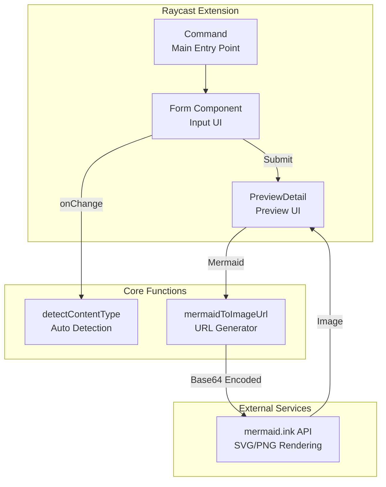
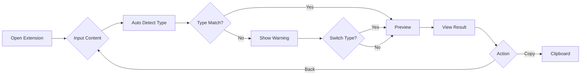
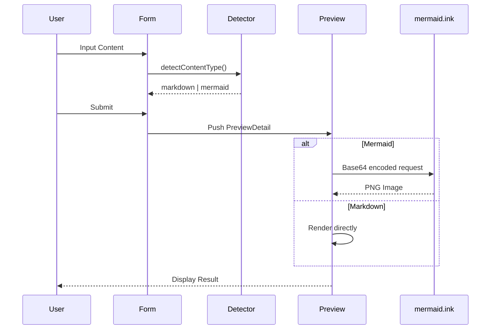
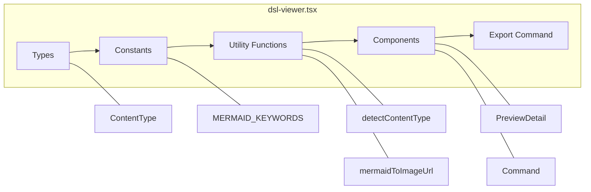

# DSL Viewer Architecture

## Overview

DSL Viewer is a Raycast extension that provides instant preview for Markdown and Mermaid diagrams.

## Component Architecture

## User Flow

## Data Flow

## Module Structure

## Key Features

| Feature | Description |
|---------|-------------|
| Auto Detection | Automatically detects Markdown vs Mermaid from content |
| Dark Theme | Custom dark theme optimized for Raycast |
| Clipboard Integration | Paste from clipboard with `Cmd+Shift+V` |
| Type Mismatch Warning | Warns when selected type doesn't match detected type |

## Tech Stack

- **Runtime**: Raycast Extension (React)
- **Language**: TypeScript
- **Mermaid Rendering**: mermaid.ink (External API)
- **State Management**: React useState/useEffect
